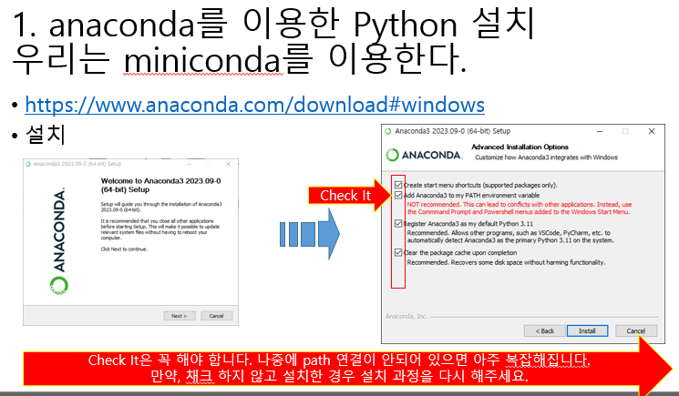
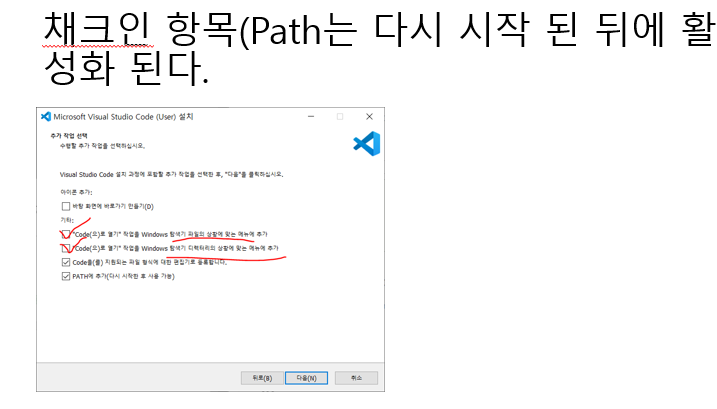
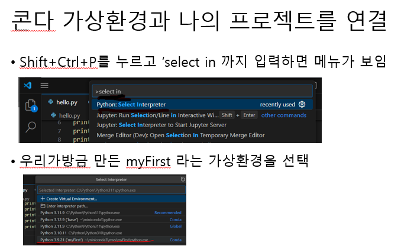
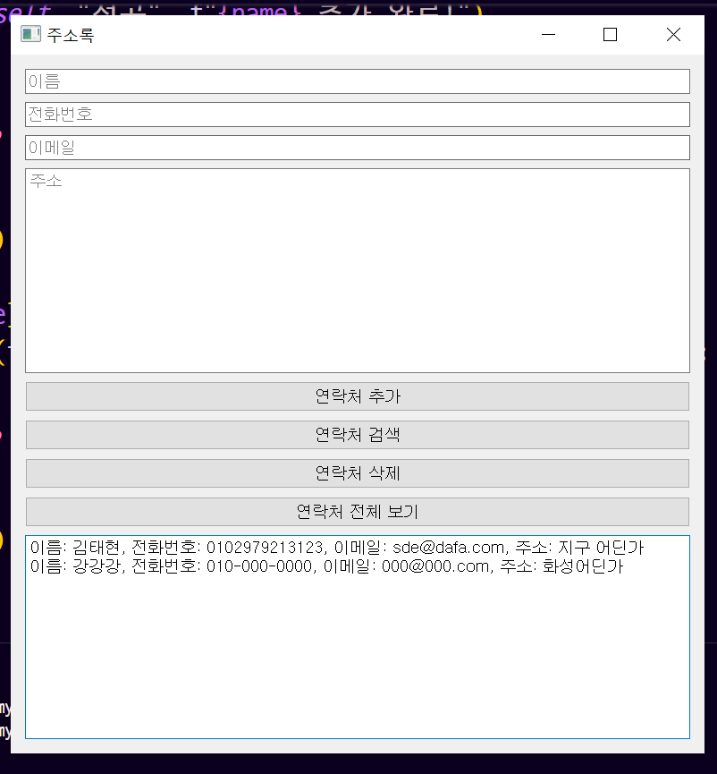

# 🐍 Python 개발 환경 구축 (GitHub README)

Python 개발 환경을 설정하는 방법을 단계별로 설명합니다. Anaconda 또는 Miniconda를 이용하여 Python 인터프리터를 설치하고, VSCode와 가상환경을 설정하여 프로그램을 실행할 수 있도록 합니다.

---

## 1️⃣ Anaconda 또는 Miniconda 설치

Python 인터프리터를 설치하기 위해 [Anaconda](https://www.anaconda.com/) 또는 [Miniconda](https://docs.conda.io/en/latest/miniconda.html)를 사용할 수 있습니다.

- Anaconda를 설치하면 다양한 패키지가 포함되어 있어 편리합니다.
- Miniconda는 가볍고 필요한 패키지만 설치할 수 있습니다.

📌 **설치 화면 예시:**  


---

## 2️⃣ VSCode 설치 및 설정

코드를 편집하고 실행하기 위해 [Visual Studio Code](https://code.visualstudio.com/)를 설치합니다. 

- Python 확장을 설치하여 Python 개발을 더욱 편리하게 할 수 있습니다.
- Conda 가상환경과 연동하여 실행할 수 있습니다.

📌 **설치 화면 예시:**  


---

## 3️⃣ Python 가상 환경 설정

프로젝트별 독립적인 환경을 만들기 위해 가상환경을 생성합니다.

```bash
conda create -n myFirst python=3.9
```

가상환경 활성화:

```bash
conda activate myFirst
```

📌 **가상환경 생성 화면 예시:**  


---

## 4️⃣ 가상환경과 VSCode 연결

1. VSCode에서 `Ctrl + Shift + P` 를 눌러 `Python: Select Interpreter`를 검색합니다.
2. 생성한 가상환경(`myFirst`)을 선택합니다.

📌 **연결 화면 예시:**  


---

## 5️⃣ 프로그램 실행 (샘플: 주소록)

가상환경이 설정되었으면, Python 프로그램을 실행할 수 있습니다.
예제 코드 (`address_book.py`) 실행:

```bash
python address_book.py
```

📌 **완성된 프로그램 실행 화면:**  


---

✅ 이제 Python 개발 환경이 완벽하게 구축되었습니다! 🚀
